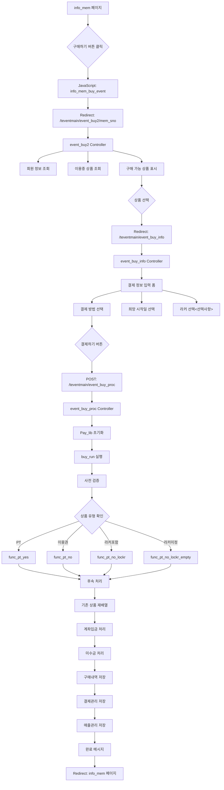
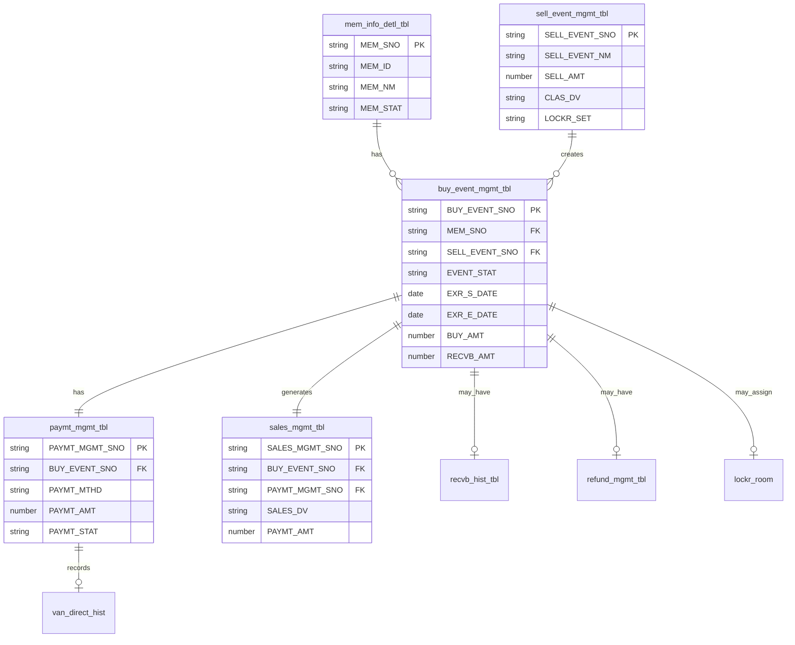

# SpoqPlus 결제 시스템 상세 문서

## 목차
1. [시스템 개요](#시스템-개요)
2. [결제 프로세스 플로우차트](#결제-프로세스-플로우차트)
3. [주요 컴포넌트](#주요-컴포넌트)
4. [데이터베이스 구조](#데이터베이스-구조)
5. [API 플로우](#api-플로우)
6. [상태 코드 정의](#상태-코드-정의)

## 시스템 개요

SpoqPlus 결제 시스템은 피트니스/스포츠 센터의 회원권, PT, 라커 등의 상품 판매 및 결제를 관리하는 종합 시스템입니다.

### 주요 특징
- 다양한 상품 유형 지원 (이용권, PT, 라커, 1일권)
- 복수 결제 수단 (카드, 현금, 계좌이체, 미수)
- 휴회 및 환불 관리
- 멀티 지점 지원
- 선물하기 기능

## 결제 프로세스 플로우차트



## 주요 컴포넌트

### 1. Controllers

#### Teventmain.php
- **event_buy2($mem_sno)**: 상품 선택 페이지
- **event_buy_info($send_sno)**: 결제 정보 입력 페이지
- **event_buy_proc()**: 결제 처리 실행

### 2. Libraries

#### Pay_lib.php
결제 처리의 핵심 라이브러리

주요 메소드:
- `buy_run($pay_issue)`: 구매 실행
- `func_sell_event_info()`: 판매 상품 정보 조회
- `func_buy_event_info()`: 기존 구매 정보 조회
- `func_mem_info()`: 회원 정보 조회
- `func_acct_rtrct_check()`: 출입제한 조건 체크
- `func_pt_yes()`: PT 상품 처리
- `func_pt_no()`: 이용권 상품 처리
- `func_pt_no_lockr()`: 라커 포함 상품 처리
- `func_misu_proc()`: 미수금 처리
- `func_buy_proc()`: 구매내역 저장
- `func_paymt_proc()`: 결제관리 저장

### 3. Models

#### PayModel.php
- 매출 관리 (sales_mgmt_tbl)
- 결제 관리 (paymt_mgmt_tbl)
- 환불 관리 (refund_mgmt_tbl)
- 구매 이벤트 관리 (buy_event_mgmt_tbl)
- 미수금 관리 (recvb_hist_tbl)

#### EventModel.php
- 판매 상품 관리
- 이벤트 정보 조회

#### MemModel.php
- 회원 정보 관리
- 회원 상태 업데이트

## 데이터베이스 구조

### 핵심 테이블 관계도



### 주요 테이블 상세

#### 1. sales_mgmt_tbl (매출 관리)
- 모든 매출 거래 기록
- 결제 방법, 금액, 상태 추적
- 회원별 매출 이력 관리

#### 2. paymt_mgmt_tbl (결제 관리)
- 결제 수단별 상세 정보
- 승인번호, 결제일시 기록
- 취소/환불 상태 관리

#### 3. buy_event_mgmt_tbl (구매 상품 관리)
- 회원이 구매한 상품 정보
- 이용 기간, 잔여 횟수 관리
- 휴회, 양도, 환불 가능 여부

#### 4. recvb_hist_tbl (미수금 이력)
- 미납 금액 추적
- 부분 납부 이력
- 미수 상태 관리

## API 플로우

### 결제 요청 플로우

```
1. 클라이언트 → 서버: 결제 정보 POST
   - mem_sno: 회원 번호
   - sell_event_sno: 상품 번호
   - pay_card_amt: 카드 결제액
   - pay_cash_amt: 현금 결제액
   - pay_acct_amt: 계좌 이체액
   - pay_misu_amt: 미수액
   - pay_exr_s_date: 희망 시작일

2. 서버 처리:
   - 회원 정보 검증
   - 상품 정보 확인
   - 기존 이용 상품과 충돌 체크
   - 결제 처리 (VAN/PG 연동)
   - DB 트랜잭션 처리

3. 서버 → 클라이언트: 결과 반환
   - 성공: 구매 완료 메시지 + info_mem 페이지로 리다이렉트
   - 실패: 오류 메시지 표시
```

## 상태 코드 정의

### PAYMT_STAT (결제 상태)
- `00`: 정상 결제
- `01`: 취소/환불
- `02`: 부분 환불
- `03`: 처리중

### EVENT_STAT (상품 상태)
- `00`: 이용중
- `01`: 종료
- `02`: 예약됨
- `03`: 휴회
- `04`: 취소
- `05`: 환불

### PAYMT_MTHD (결제 방법)
- `CARD`: 카드
- `CASH`: 현금
- `ACCT`: 계좌이체
- `MISU`: 미수

### PAYMT_CHNL (결제 채널)
- `P`: PC/데스크
- `M`: 모바일
- `K`: 키오스크

### SALES_DV (매출 구분)
- `00`: 신규
- `01`: 재등록
- `02`: 업그레이드
- `03`: 다운그레이드

## 특수 기능

### 1. 미수금 관리
- 부분 결제 허용
- 미수금 자동 추적
- 미수금 회수 알림

### 2. 휴회 처리
- 휴회 가능 일수/횟수 제한
- 자동 종료일 연장
- 휴회 중 이용 제한

### 3. 라커 연동
- 상품별 라커 자동 배정
- 성별 구분 라커 관리
- 라커 이용 기간 동기화

### 4. 선물하기
- 타 회원 상품 구매
- 선물 수령 알림
- 선물 거절 기능

## 보안 고려사항

1. **결제 정보 암호화**
   - API 키 암호화 저장
   - 카드 정보 비저장 원칙

2. **트랜잭션 무결성**
   - DB 트랜잭션 처리
   - 실패 시 자동 롤백

3. **접근 권한 관리**
   - 역할별 권한 분리
   - 결제 취소 권한 제한

4. **로깅 및 감사**
   - 모든 결제 활동 로깅
   - 이상 거래 탐지

---

*문서 생성일: 2025-07-24*
*작성자: Claude AI Assistant*