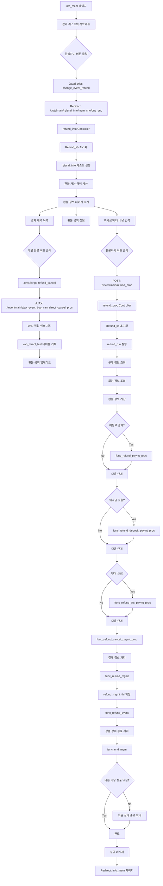
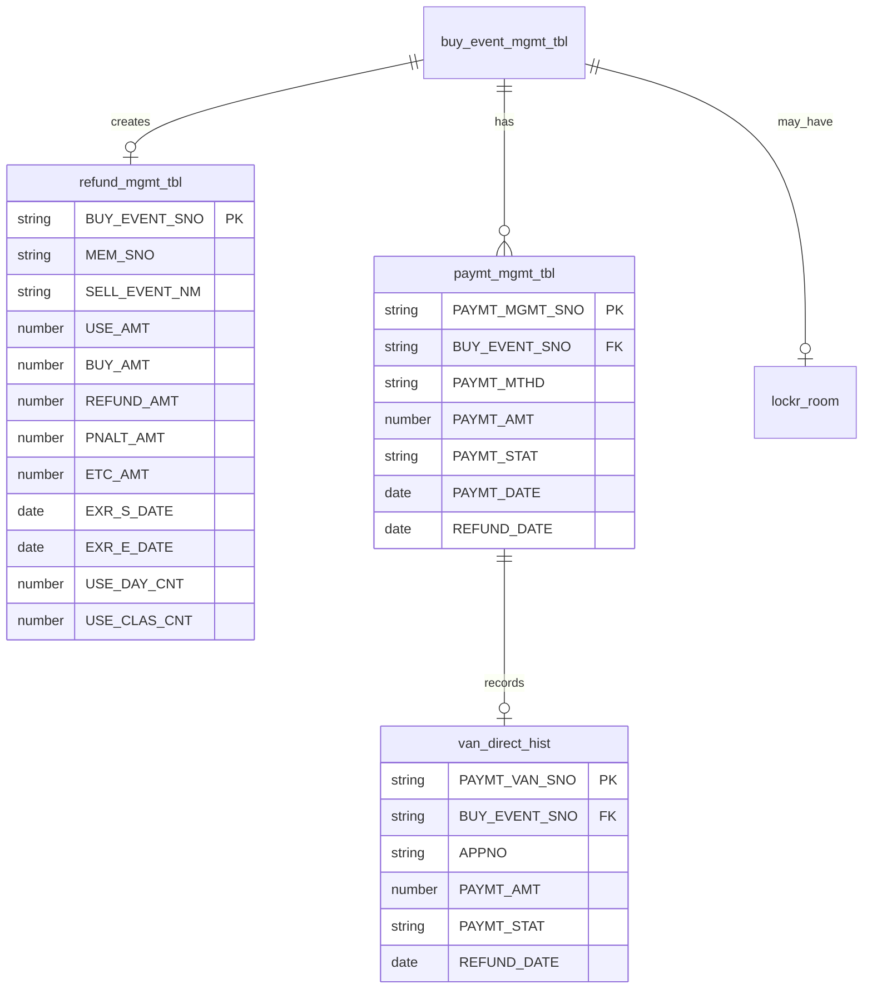

# SpoqPlus 환불 시스템 상세 문서

## 목차
1. [시스템 개요](#시스템-개요)
2. [환불 프로세스 플로우차트](#환불-프로세스-플로우차트)
3. [주요 컴포넌트](#주요-컴포넌트)
4. [데이터베이스 구조](#데이터베이스-구조)
5. [환불 처리 상세](#환불-처리-상세)
6. [상태 코드 정의](#상태-코드-정의)
7. [특수 기능](#특수-기능)

## 시스템 개요

SpoqPlus 환불 시스템은 회원이 구매한 상품(이용권, PT, 라커 등)을 환불 처리하는 종합 시스템입니다. 이용 기간 및 횟수를 계산하여 정확한 환불 금액을 산정하고, 위약금 및 기타 비용을 처리합니다.

### 주요 특징
- 일할 계산 환불 (사용 일수/횟수 기반)
- 위약금 및 기타 비용 별도 처리
- 카드/현금/계좌이체 환불 지원
- VAN 직접 취소 연동
- 라커 자동 해제
- 회원 상태 자동 업데이트

## 환불 프로세스 플로우차트



## 주요 컴포넌트

### 1. Views

#### info_mem.php / info_mem2.php / info_mem3.php
- 회원 정보 페이지에서 구매 상품 목록 표시
- 각 상품의 서브메뉴에 "환불하기" 버튼 포함
- JavaScript 함수: `change_event_refund(mem_sno, buy_sno, event_stat)`

#### refund_info.php
- 환불 상세 정보 페이지
- 환불 가능 금액 표시
- 결제 내역별 개별 환불 버튼
- 위약금 및 기타 비용 입력 폼
- JavaScript 함수: `refund_cancel(paymt_sno, paymt_amt, ctype)`

### 2. Controllers

#### Ttotalmain.php
- **refund_info($mem_sno, $buy_sno)**: 환불 정보 페이지 표시
  - Refund_lib 사용하여 환불 가능 금액 계산
  - 회원 정보 및 구매 상품 정보 조회
  - 결제 내역 목록 조회

#### Teventmain.php
- **ajax_event_buy_van_direct_cancel_proc()**: AJAX 개별 결제 취소
  - VAN 직접 취소 처리
  - van_direct_hist 테이블에 취소 기록
  
- **refund_proc()**: 전체 환불 처리
  - POST 데이터 수신 및 검증
  - Refund_lib를 통한 환불 실행
  - 완료 후 회원 정보 페이지로 리다이렉트

### 3. Libraries

#### Refund_lib.php
환불 처리의 핵심 라이브러리

**주요 public 메소드:**
- `refund_info()`: 환불 정보 조회 및 계산
- `refund_run($refund_issue)`: 환불 실행
- `refund_result()`: 환불 결과 반환

**주요 private 메소드:**
- `func_get_buy_event_info()`: 구매 정보 조회
- `func_mem_info()`: 회원 정보 조회
- `func_refund_info()`: 환불 금액 계산
- `func_refund_paymt_proc()`: 이용료 결제 처리
- `func_refund_deposit_paymt_proc()`: 위약금 처리
- `func_refund_etc_paymt_proc()`: 기타 비용 처리
- `func_refund_cancel_paymt_proc()`: 나머지 금액 환불
- `func_refund_mgmt()`: 환불 내역 저장
- `func_refund_event()`: 상품 종료 처리
- `func_end_mem()`: 회원 상태 업데이트

**환불 금액 계산 로직:**
```
1. PT 상품의 경우:
   - 1회 수업 금액 = 구매 금액 / 총 수업 횟수
   - 사용 금액 = 1회 수업 금액 × 사용 횟수
   - 환불 금액 = 구매 금액 - 사용 금액

2. 이용권 상품의 경우:
   - 1일 이용 금액 = 구매 금액 / 총 이용 일수
   - 사용 금액 = 1일 이용 금액 × 사용 일수
   - 환불 금액 = 구매 금액 - 사용 금액

3. 추가 계산:
   - 위약금 = 설정된 위약금 비율 × 환불 금액
   - 최종 환불 금액 = 환불 금액 - 위약금 - 기타 비용
```

### 4. Models

#### PayModel.php
- **insert_refund_mgmt_tbl()**: 환불 내역 저장
- **update_paymt_mgmt_cancel_tbl()**: 결제 상태 환불로 업데이트
- **update_buy_event_cancel_tbl()**: 구매 상품 종료 처리
- **update_lockr_room()**: 라커 해제 처리

#### EventModel.php
- **get_refund_mgmt_for_buy_sno()**: 환불 정보 조회
- **list_refund_paymt_mgmt()**: 환불 가능 결제 목록 조회
- **end_chk_event_mem_sno()**: 회원의 다른 이용 상품 확인

#### VanModel.php
- **insert_van_direct_hist()**: VAN 취소 이력 저장

## 데이터베이스 구조

### 환불 관련 핵심 테이블



### 주요 테이블 상세

#### 1. refund_mgmt_tbl (환불 관리)
환불 내역을 상세히 기록하는 테이블

**주요 컬럼:**
- `BUY_EVENT_SNO`: 구매 상품 번호
- `USE_AMT`: 사용 금액
- `BUY_AMT`: 구매 금액
- `REFUND_AMT`: 환불 금액
- `PNALT_AMT`: 위약금
- `ETC_AMT`: 기타 비용
- `USE_DAY_CNT`: 사용 일수
- `USE_CLAS_CNT`: 사용 수업 횟수

#### 2. paymt_mgmt_tbl (결제 관리)
결제 정보 관리 및 환불 상태 추적

**환불 관련 업데이트:**
- `PAYMT_STAT`: '00' → '01' (정상 → 환불)
- `REFUND_DATE`: 환불 처리 일자

#### 3. van_direct_hist (VAN 직접 이력)
VAN 취소 거래 기록

**주요 컬럼:**
- `PAYMT_VAN_SNO`: VAN 거래 번호
- `PAYMT_STAT`: '01' (환불)
- `REFUND_DATE`: 환불 일자

## 환불 처리 상세

### 1. 환불 가능 여부 체크
- 상품 상태 확인 (이용중/예약됨만 가능)
- 환불 가능 설정 확인
- 이미 환불된 건 제외

### 2. 환불 금액 계산
- 총 이용 기간/횟수 대비 실제 사용량 계산
- 일할/회차별 정확한 금액 산정
- 미수금이 있는 경우 차감

### 3. 환불 실행 단계
1. **개별 결제 취소** (AJAX)
   - 카드: VAN 취소 요청
   - 현금/계좌: 수동 환불 기록

2. **전체 환불 처리**
   - 이용료 정산
   - 위약금 수납
   - 기타 비용 처리
   - 잔액 환불

3. **데이터베이스 업데이트**
   - 환불 내역 저장
   - 결제 상태 변경
   - 상품 종료 처리
   - 라커 해제
   - 회원 상태 확인

## 상태 코드 정의

### PAYMT_STAT (결제 상태)
- `00`: 정상 결제
- `01`: 환불/취소

### EVENT_STAT (상품 상태)
- `00`: 이용중
- `01`: 종료
- `02`: 예약됨
- `03`: 휴회

### MEM_STAT (회원 상태)
- `00`: 가입회원
- `01`: 현재회원
- `90`: 종료회원

## 특수 기능

### 1. 부분 환불
- 결제 건별 개별 환불 가능
- 여러 결제 수단 혼합 환불

### 2. 위약금 처리
- 환불 시 위약금 자동 계산
- 별도 결제로 위약금 수납

### 3. 라커 자동 해제
- 라커 포함 상품 환불 시 자동 해제
- 라커 상태 즉시 이용 가능으로 변경

### 4. 회원 상태 관리
- 마지막 상품 환불 시 자동 종료회원 전환
- 다른 이용 상품 있으면 현재회원 유지

### 5. 환불 이력 추적
- 모든 환불 내역 상세 기록
- 환불 사유 및 처리자 정보 저장

## 보안 고려사항

1. **권한 검증**
   - 환불 권한 체크
   - 금액 한도 설정

2. **트랜잭션 처리**
   - 환불 프로세스 원자성 보장
   - 실패 시 전체 롤백

3. **이중 환불 방지**
   - 환불 상태 실시간 체크
   - 동시 처리 방지

4. **감사 추적**
   - 모든 환불 활동 로깅
   - 처리자 및 시간 기록

---

*문서 생성일: 2025-07-24*
*작성자: Claude AI Assistant*